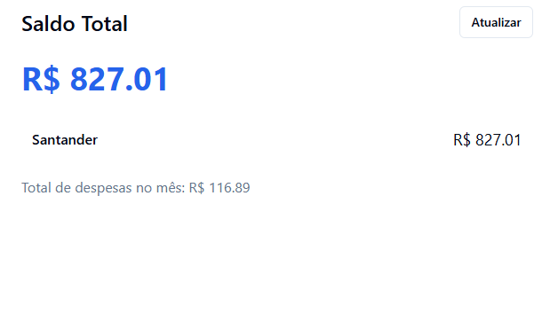
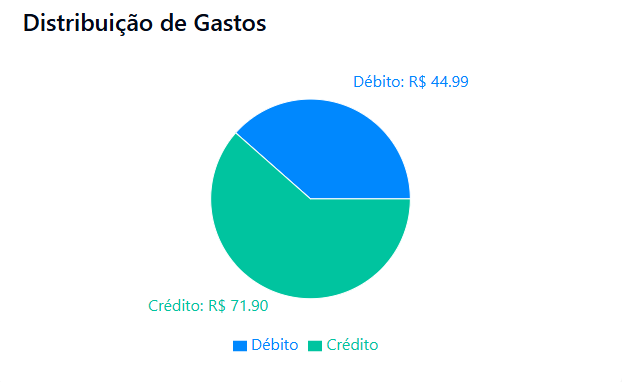

# 💰 Finanças Pessoais

Sistema para controle de finanças pessoais com registro de despesas por tipo de pagamento (débito, crédito ou dinheiro), visualização gráfica e gerenciamento de contas e métodos de pagamento.

🔗 **Acesse online**: [https://financas.rennan-alves.com/login](https://financas.rennan-alves.com/login)

Desenvolvido por **Rennan Alves**  
Licença: **MIT**

---

## 📸 Imagens do Sistema

### Tela de Saldo e Gastos


### Distribuição de Gastos


---

## ⚙️ Tecnologias Utilizadas

- **Frontend**: React + Vite + TailwindCSS
- **Backend**: PHP procedural
- **Banco de Dados**: MariaDB/MySQL

---

## 🚀 Como Executar Localmente

### Requisitos

- [Node.js](https://nodejs.org/)
- [XAMPP (PHP + Apache + MySQL)](https://www.apachefriends.org/)
- Navegador moderno

---

### 🔧 Configuração do Backend

1. Certifique-se de que o Apache e MySQL do XAMPP estão **ativos**.
2. Copie os arquivos da pasta `codigo_fonte/backend/` para a pasta `htdocs` do XAMPP.
3. Edite o arquivo `config.php` com as credenciais corretas do seu banco de dados MySQL local.
4. Crie o banco de dados com o nome desejado e execute o script de criação localizado em:
`docs/banco-dados/scripts/create-schema.sql`


---

### 🌐 Configuração do Frontend

1. Navegue até a pasta `codigo_fonte/frontend/`:

```bash
cd codigo_fonte/frontend
```

2. Instale as dependências com o NPM:

```bash
npm install
```

3. Execute o projeto em ambiente de desenvolvimento:

```bash
npm run dev
```

4. Acesse no navegador: http://localhost:5173 (ou a URL exibida no terminal).

---

## 📂 Estrutura do Projeto

```bash
financas/
├── codigo_fonte/
│   ├── backend/         # Código PHP do backend
│   └── frontend/        # Aplicação React com TailwindCSS
├── docs/                # Documentação técnica
│   └── banco-dados/
│       └── scripts/
│           └── create-schema.sql
└── README.md

```