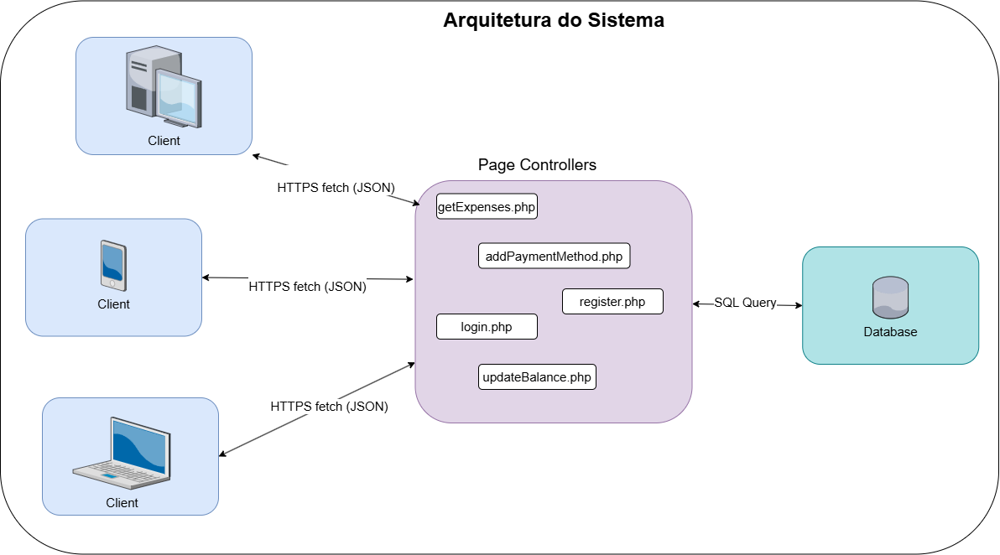

# Arquitetura do Sistema - Finanças Pessoais

Este documento detalha as decisões arquiteturais tomadas para o desenvolvimento do sistema de Finanças Pessoais, descrevendo os padrões utilizados tanto no backend quanto no frontend e como eles se comunicam.

---

## 1. Visão Geral da Arquitetura

O sistema adota uma arquitetura clássica **Cliente-Servidor**, onde as responsabilidades estão claramente separadas:

* **Cliente (Frontend):** Uma aplicação web moderna e reativa, responsável pela interface do usuário, navegação e estado da aplicação no navegador.
* **Servidor (Backend):** Um conjunto de scripts procedurais responsáveis pela lógica de negócios, autenticação e persistência de dados no banco de dados MySQL.
* **Comunicação:** O frontend se comunica com o backend através de requisições HTTP (fetch API), trocando dados predominantemente no formato JSON.

---

## 2. Backend: Padrão Page Controller

A arquitetura do backend foi construída seguindo o padrão de projeto **Page Controller**.

### Conceito e Referência Teórica

O padrão Page Controller é um dos padrões fundamentais para desenvolvimento web, catalogado por **Martin Fowler** em seu livro clássico, *"Patterns of Enterprise Application Architecture"* (Padrões de Arquitetura de Aplicações Corporativas).

Segundo Fowler, a definição do padrão é:

> "Um objeto que trata uma requisição para uma página ou ação específica em um site Web."

Na prática, isso significa que para cada ação distinta que o sistema pode realizar (como "fazer login", "adicionar despesa" ou "listar métodos de pagamento"), existe um arquivo PHP físico correspondente no servidor que atua como o controlador exclusivo daquela requisição.

### Aplicação no Projeto

Diferente de frameworks MVC modernos que utilizam um "Front Controller" (um único ponto de entrada que roteia as requisições), este projeto utiliza scripts PHP independentes como pontos de entrada diretos.

* Quando o frontend precisa autenticar um usuário, ele envia uma requisição POST diretamente para `/backend/login.php`.
* Quando precisa buscar as despesas, ele chama `/backend/getExpenses.php`.

Essa abordagem oferece simplicidade na implementação e manutenção para o escopo atual do projeto, onde cada script tem uma responsabilidade única e bem definida.

### Diagrama da Arquitetura

Abaixo está uma representação visual da arquitetura implementada, destacando o fluxo entre a SPA e os múltiplos Page Controllers.



---

## 3. Frontend: Single Page Application (SPA)

O frontend foi desenvolvido utilizando **React** e adota o modelo de **Single Page Application (SPA)**.

Diferente de aplicações web tradicionais onde cada clique carrega uma nova página HTML do servidor, a SPA carrega uma única página HTML inicial (`index.html`) e, a partir daí, o JavaScript (React) assume o controle.

* **Navegação Fluida:** O roteamento entre as "páginas" (Home, Perfil, Cartões) é gerenciado no lado do cliente (browser), atualizando o conteúdo da tela dinamicamente sem recarregar a página inteira.
* **Componentização:** A interface é construída através de componentes reutilizáveis (localizados em `src/components/`), facilitando a manutenção e garantindo consistência visual (utilizando Tailwind CSS e Shadcn/UI).

---

## 4. Estrutura de Diretórios e Arquivos

Abaixo está a estrutura física do projeto, detalhando como os padrões acima se refletem na organização dos arquivos.

### 📂 Raiz do Projeto

```
📂 codigo_fonte
│
├── 📂 backend (Implementação Page Controller)
│   │   # Endpoints principais de despesas e métodos
│   ├── 📄 addExpense.php
│   ├── 📄 addPaymentMethod.php
│   ├── 📄 config.php                (Configuração do Banco de Dados)
│   ├── 📄 deleteExpense.php
│   ├── 📄 deletePaymentMethod.php
│   ├── 📄 getExpenses.php
│   ├── 📄 getPaymentMethods.php
│   ├── 📄 login.php                 (Endpoint de Autenticação)
│   ├── 📄 payCreditExpense.php
│   ├── 📄 register.php
│   ├── 📄 updateBalance.php
│   ├── 📄 updateExpense.php
│   │
│   └── 📂 accounts (Endpoints de gerenciamento de conta)
│       ├── 📄 delete_account.php
│       ├── 📄 logout.php
│       ├── 📄 profile.php
│       └── 📄 update_password.php
│
└── 📂 frontend
    ├── 📄 package.json              (Dependências do projeto)
    ├── 📄 vite.config.js            (Configuração do Bundler)
    ├── 📄 tailwind.config.js        (Configuração de Estilos)
    │
    ├── 📂 public
    │   └── 📄 favicon.png
    │
    └── 📂 src
        ├── 📄 main.jsx              (Ponto de entrada do React)
        ├── 📄 App.jsx               (Componente raiz e roteamento)
        ├── 📄 index.css             (Estilos globais)
        │
        ├── 📂 components            (Componentes reutilizáveis de UI e Lógica)
        │   ├── 📄 Dashboard.jsx
        │   ├── 📄 ExpenseList.jsx
        │   ├── 📄 Layout.jsx
        │   ├── 📂 ui                (Componentes base do Shadcn/UI)
        │   │   ├── 📄 button.jsx
        │   │   ├── 📄 input.jsx
        │   │   ├── 📄 dialog.jsx
        │   │   └── ... (Outros componentes UI)
        │   │
        │   └── ... (Diálogos de Adicionar/Editar Despesa/Cartão)
        │
        ├── 📂 lib
        │   └── 📄 utils.js          (Funções utilitárias)
        │
        └── 📂 pages                 (Visualizações das Rotas da SPA)
            ├── 📄 Home.jsx
            ├── 📄 Login.jsx
            ├── 📄 Profile.jsx
            └── ... (Outras páginas do sistema)
```

---

## 5. Conclusão da Arquitetura

A combinação de uma **Single Page Application** no frontend com o padrão **Page Controller** no backend resulta em um sistema onde a experiência do usuário é ágil e moderna, enquanto o servidor mantém uma estrutura simples, direta e fácil de entender, sem a necessidade de frameworks complexos de backend para o escopo atual.