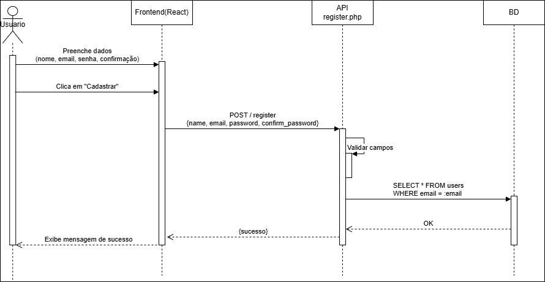
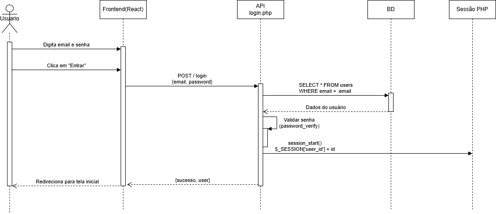
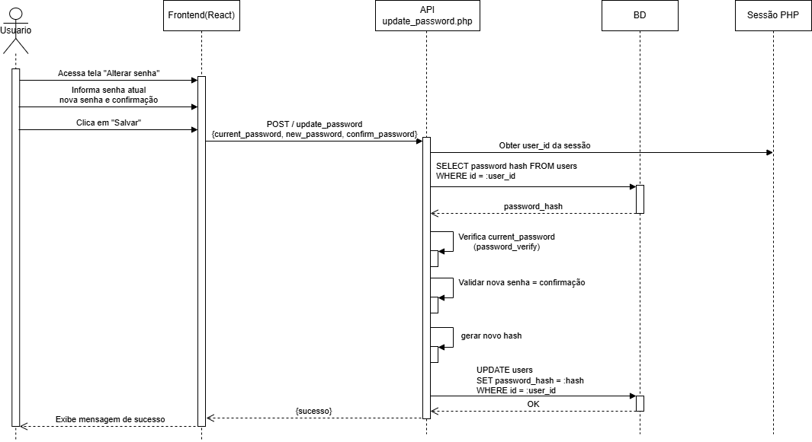
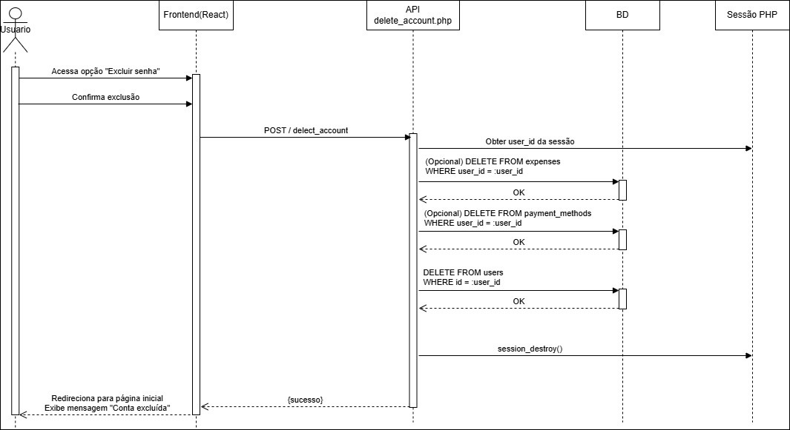
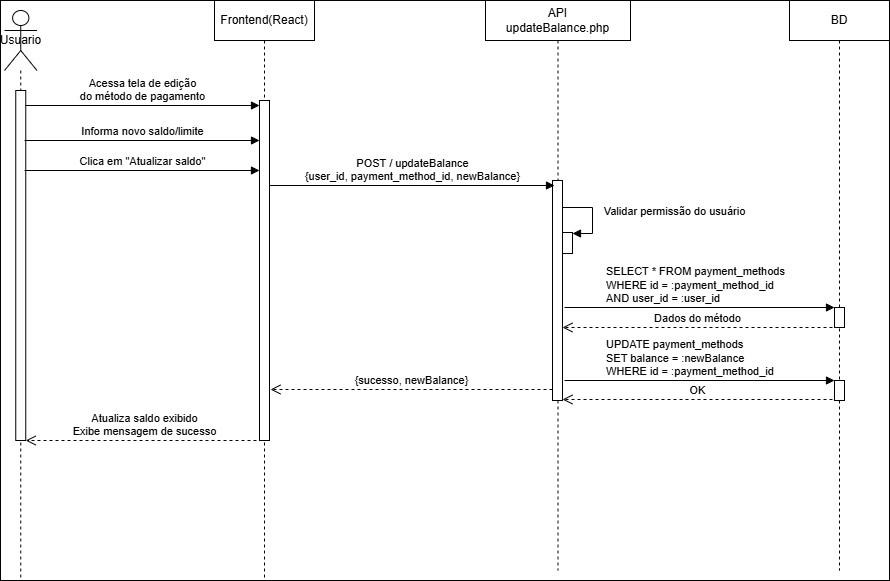
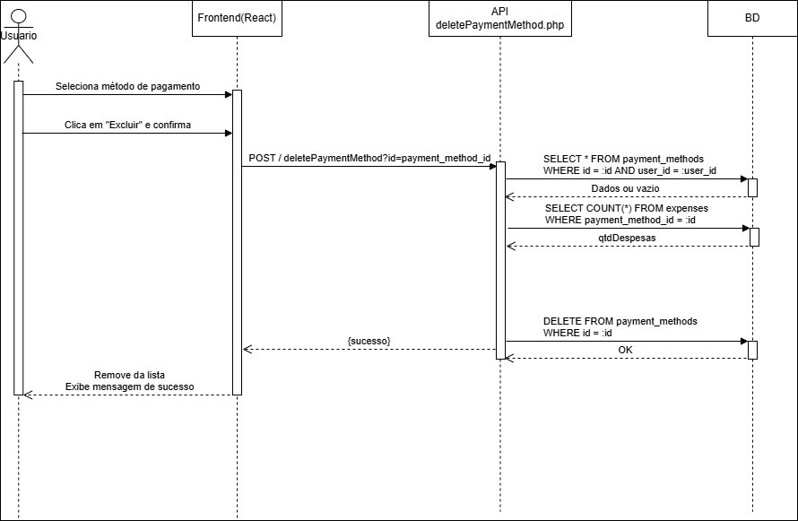
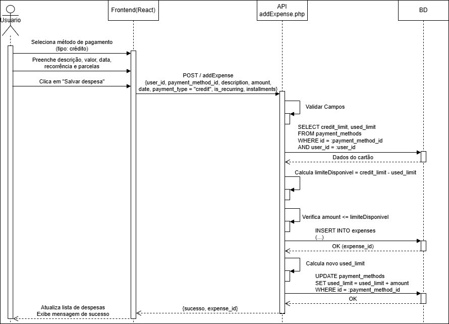
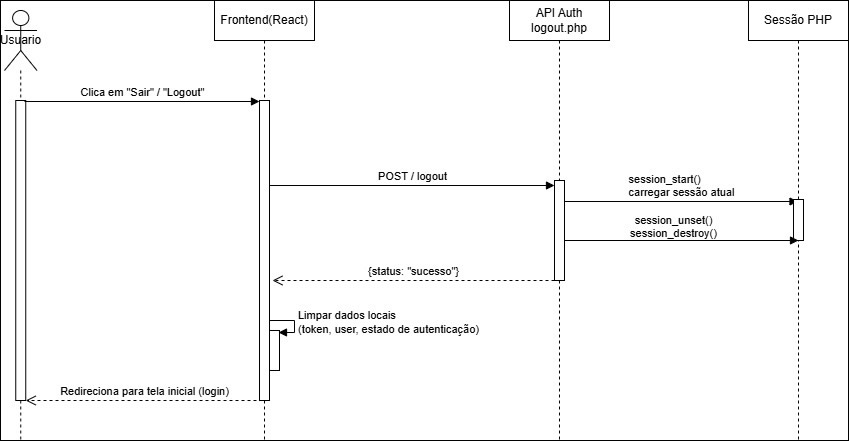

# Modelagem Estrutural e Comportamental do Sistema de Finanças Pessoais

Este documento apresenta a modelagem estrutural e comportamental do Sistema de Finanças Pessoais, contemplando os principais elementos estáticos (classes e relacionamentos) e dinâmicos (casos de uso e fluxos de interação ao longo do tempo). A partir desses modelos é possível compreender, de maneira organizada e coerente, como o sistema está estruturado internamente e como os usuários interagem com suas funcionalidades.

A modelagem aqui descrita visa apoiar tanto a documentação técnica quanto a comunicação entre desenvolvedores, analistas e demais stakeholders, servindo como referência para manutenção, evolução e validação da solução proposta. Os diagramas apresentados (casos de uso, classes e sequência) estão alinhados com a implementação atual do sistema, baseada em uma arquitetura web com frontend em React e backend em PHP.

---

## 1. Visão Geral da Modelagem

A modelagem do Sistema de Finanças Pessoais foi organizada em duas perspectivas complementares: a <strong>modelagem estrutural</strong>, responsável por descrever a organização estática dos elementos do sistema (entidades, atributos e relacionamentos), e a <strong>modelagem comportamental</strong>, responsável por descrever como o sistema se comporta em resposta às interações dos usuários e aos eventos de negócio.

Na modelagem estrutural, o foco recai sobre o <strong>Diagrama de Classes</strong>, que apresenta as principais entidades do domínio (usuário, métodos de pagamento, despesas, etc.) e seus relacionamentos. Já na modelagem comportamental, utilizam-se o <strong>Diagrama de Casos de Uso</strong>, que mostra as funcionalidades vistas pelo usuário, e os <strong>Diagramas de Sequência</strong>, que detalham o fluxo de mensagens entre os componentes do sistema para cada funcionalidade relevante.

---

## 2. Modelagem Estrutural

### 2.1 Diagrama de Classes

O diagrama de classes representa a estrutura estática do Sistema de Finanças Pessoais, destacando as principais classes que compõem o modelo de domínio, seus atributos, operações (métodos) e os relacionamentos existentes entre elas (associações, cardinalidades e papéis). Esse diagrama serve de base para o mapeamento entre o modelo conceitual e a implementação em código.

No contexto deste sistema, o diagrama de classes contempla, entre outras, as seguintes classes principais: <strong>Usuário</strong>, <strong>MétodoPagamento</strong> e <strong>Despesa</strong>. A classe <em>Usuário</em> representa a entidade responsável por realizar login, gerenciar seus métodos de pagamento e registrar despesas. A classe <em>MétodoPagamento</em> modela cartões de crédito, cartões de débito e contas (dinheiro), com atributos como tipo e saldo. A classe <em>Despesa</em> registra os lançamentos financeiros, associando cada despesa a um usuário e a um método de pagamento. Os relacionamentos entre essas classes refletem que um usuário pode possuir vários métodos de pagamento e diversas despesas, e que um método de pagamento pode estar vinculado a múltiplas despesas.

A seguir, apresenta-se o diagrama de classes do sistema:

  

---

## 3. Modelagem Comportamental

A modelagem comportamental descreve como o sistema reage às interações dos usuários e como as funcionalidades são executadas ao longo do tempo. Essa perspectiva complementa a visão estrutural, mostrando o comportamento dinâmico das classes e componentes, bem como a orquestração de chamadas entre frontend, backend e banco de dados.

Nesta seção são apresentados o <strong>Diagrama de Casos de Uso</strong>, que fornece uma visão macro das funcionalidades disponíveis para cada ator, e os <strong>Diagramas de Sequência</strong>, que detalham os fluxos de mensagens para cada uma das principais operações de negócio do sistema de finanças pessoais.

### 3.1 Diagrama de Casos de Uso

O diagrama de casos de uso apresenta as funcionalidades do sistema sob a perspectiva dos atores que interagem com ele. No Sistema de Finanças Pessoais, podem ser destacados, por exemplo, o <em>Visitante</em> (usuário ainda não autenticado) e o <em>Usuário Autenticado</em>. O visitante é capaz de se cadastrar e realizar login, enquanto o usuário autenticado pode alterar sua senha, excluir sua conta, cadastrar métodos de pagamento, registrar despesas, atualizar saldos e consultar informações financeiras.

Os casos de uso abrangem funcionalidades como: cadastro de usuário, validação de login, gerenciamento de métodos de pagamento (cadastro, atualização de saldo e exclusão), registro de despesas em cartão de crédito e débito, alteração e exclusão de despesas e cálculo do saldo após uma compra no débito. O diagrama evidencia, ainda, relações de inclusão entre casos de uso, como a necessidade de validação de credenciais para execução de certas operações.

A seguir, apresenta-se o diagrama de casos de uso do sistema:

  

---

### 3.2 Diagramas de Sequência

Os diagramas de sequência detalham o comportamento dinâmico do sistema, mostrando a troca de mensagens entre os participantes (atores, frontend, backend e banco de dados) ao longo do tempo para cada funcionalidade específica. Cada diagrama evidencia a ordem das chamadas, os dados trafegados e o papel de cada componente no fluxo de execução de uma operação.

No Sistema de Finanças Pessoais, os diagramas de sequência foram elaborados para as principais funcionalidades, incluindo cadastro de usuário, validação de login, alteração de senha, exclusão de usuário, gestão de métodos de pagamento e registro e manutenção de despesas. Cada diagrama descreve, de forma detalhada, como o usuário interage com a interface (frontend), como o frontend se comunica com a API (backend) e como o backend acessa e manipula os dados no banco.

A seguir, são apresentados os diagramas de sequência organizados por funcionalidade.

---

#### 3.2.1 Diagrama de Sequência – Cadastro de Usuário

Este diagrama descreve o fluxo de interação para o cadastro de um novo usuário. Ele contempla as etapas em que o usuário preenche seus dados, o frontend envia a requisição de cadastro para a API, o backend valida as informações, verifica a existência prévia do e-mail no banco de dados e, em caso de sucesso, persiste o novo registro de usuário, retornando uma resposta ao frontend.

  

---

#### 3.2.2 Diagrama de Sequência – Validação de Login de Usuário

Este diagrama representa o fluxo de validação de login, incluindo a entrada das credenciais pelo usuário, o envio da requisição de autenticação ao backend, a verificação das credenciais no banco de dados e a criação de sessão em caso de sucesso. Também contempla o retorno de mensagens de erro em situações de e-mail não encontrado ou senha inválida.

  

---

#### 3.2.3 Diagrama de Sequência – Alteração de Senha

Este diagrama ilustra o processo de alteração de senha de um usuário autenticado. O fluxo inclui a submissão da senha atual e da nova senha, a validação da senha corrente no backend, a verificação da confirmação da nova senha e, em seguida, a atualização do <em>hash</em> da senha no banco de dados, caso todas as validações sejam atendidas.

  

---

#### 3.2.4 Diagrama de Sequência – Exclusão de Usuário

Este diagrama mostra o fluxo de exclusão da conta de um usuário. A interação inclui a confirmação da ação pelo usuário, o envio da requisição de exclusão ao backend, a remoção dos registros associados (como despesas e métodos de pagamento, quando aplicável) e a exclusão do usuário no banco de dados, seguida da finalização da sessão.

  

---

#### 3.2.5 Diagrama de Sequência – Cadastro de Método de Pagamento

Este diagrama descreve o fluxo de cadastro de um novo método de pagamento (como cartão de crédito, cartão de débito ou conta corrente). Inclui a entrada dos dados pelo usuário, a validação das informações no backend e a inserção do novo método de pagamento na tabela correspondente do banco de dados.

  

---

#### 3.2.6 Diagrama de Sequência – Atualizar Saldo de Cartões

Neste diagrama é representado o fluxo de atualização de saldo de um método de pagamento. O usuário informa o novo valor, o frontend envia a requisição de atualização ao backend, que valida a permissão de acesso e atualiza o saldo na base de dados, retornando o resultado ao frontend.

  

---

#### 3.2.7 Diagrama de Sequência – Exclusão de Método de Pagamento

Este diagrama apresenta o fluxo para exclusão de um método de pagamento. O backend verifica se o método de pagamento pertence ao usuário autenticado e, eventualmente, se não há dependências críticas (como despesas associadas que impeçam a exclusão), realizando a remoção do registro no banco de dados em caso de sucesso.

  

---

#### 3.2.8 Diagrama de Sequência – Cadastro de Despesas no Cartão de Crédito

Este diagrama detalha o fluxo de cadastro de uma despesa utilizando cartão de crédito. Inclui a seleção do método de pagamento, o envio das informações de despesa ao backend e o registro da despesa na base de dados, além do retorno de sucesso ou erro ao usuário.

  

---

#### 3.2.9 Diagrama de Sequência – Cadastro de Despesas no Cartão de Débito

Este diagrama descreve o fluxo de cadastro de despesa utilizando cartão de débito ou conta corrente. O backend obtém o saldo atual do método de pagamento, calcula o saldo após a compra, verifica se o saldo é suficiente, realiza o lançamento da despesa e atualiza o saldo, retornando o resultado da operação ao frontend.

  

---

#### 3.2.10 Diagrama de Sequência – Alterar Despesa

Este diagrama representa o processo de alteração de uma despesa previamente registrada. O fluxo compreende a recuperação dos dados atuais da despesa, a validação das novas informações, o ajuste de saldos (quando necessário) e a atualização do registro no banco de dados.

  

---

#### 3.2.11 Diagrama de Sequência – Excluir Despesa

Neste diagrama é apresentado o fluxo de exclusão de uma despesa. Além da remoção do registro de despesa no banco de dados, podem ser realizados ajustes nos saldos do método de pagamento associado (por exemplo, recompondo o saldo de conta), garantindo a consistência das informações financeiras do usuário.

  

---

#### 3.2.12 Diagrama de Sequência – Calcular Saldo Após Compra no Débito

Este diagrama descreve o fluxo para cálculo do saldo projetado após uma possível compra no débito. O usuário informa o valor da compra e o método de pagamento, o backend obtém o saldo atual no banco de dados, calcula o saldo resultante e retorna ao frontend a informação sobre a viabilidade da operação, bem como o saldo previsto após a transação.

  

#### 3.2.13 Diagrama de Sequência – Logout de Usuário

Este diagrama descreve o fluxo de encerramento da sessão do usuário no Sistema de Finanças Pessoais. O processo tem início quando o usuário, já autenticado, aciona a opção de logout na interface do sistema. A partir dessa ação, o frontend envia uma requisição ao backend solicitando a finalização da sessão ativa.

Ao receber a solicitação, o backend identifica a sessão associada ao usuário e executa os procedimentos necessários para sua invalidação, eliminando as variáveis de sessão e destruindo o identificador que mantém o usuário autenticado. Em seguida, o sistema confirma a conclusão da operação ao frontend, que remove os dados locais de autenticação e redireciona o usuário para a tela de login, impedindo novos acessos sem uma nova autenticação.

  

